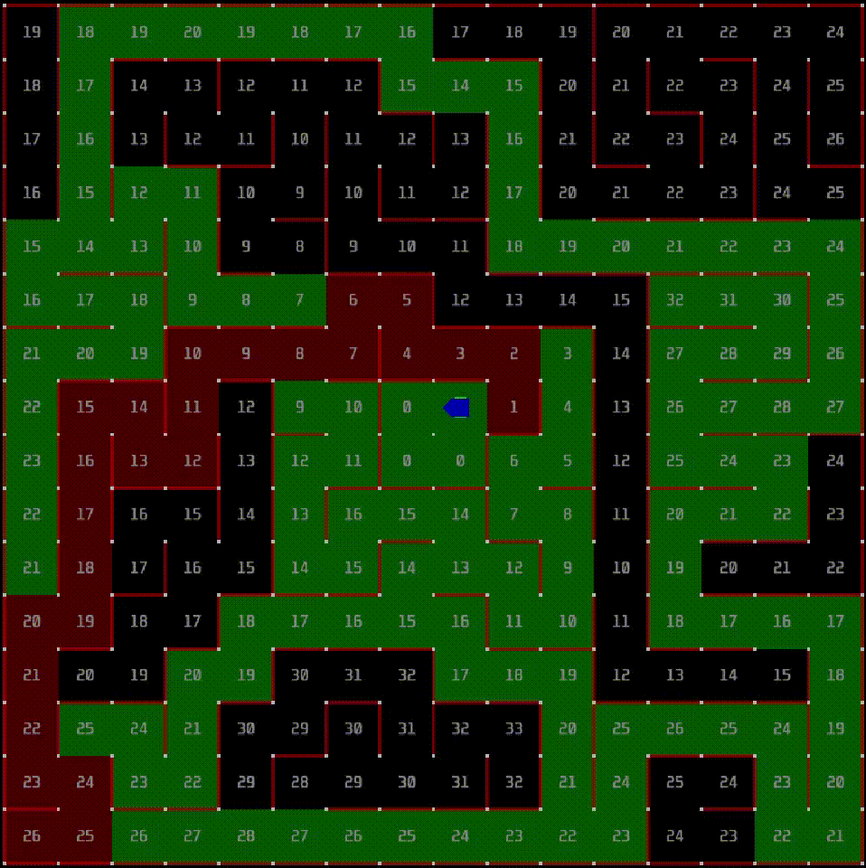

# modified-flood-fill
A Micromouse maze solving algorithm that uses flood-fill for use with [mackorone/mms](https://github.com/mackorone/mms), a Micromouse simulator.
It floods the grid and after each move it updates the flood according to the data of explored walls.
After 3 optimisation runs, waits for 5 seconds and finally runs on the optimised path without updating the flood.

